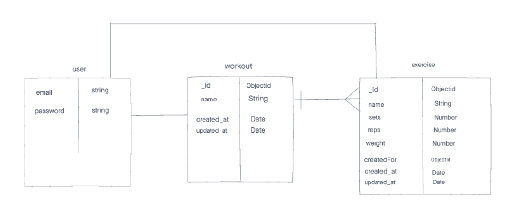
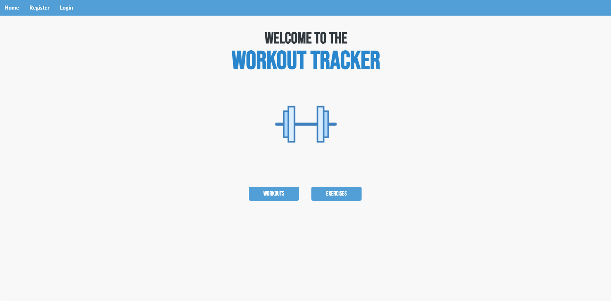
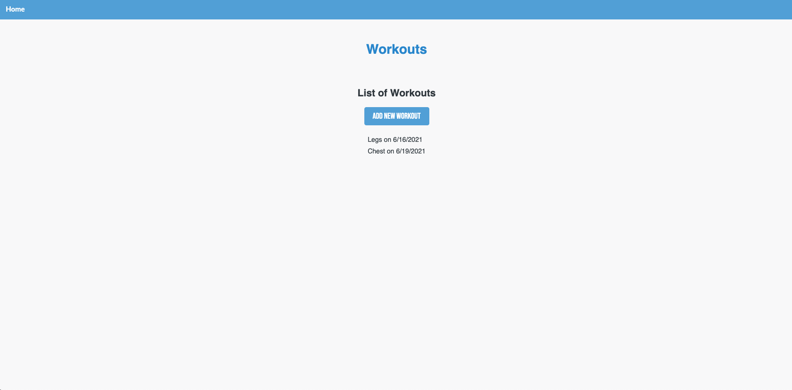
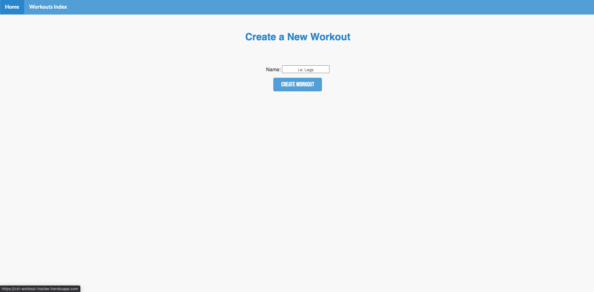
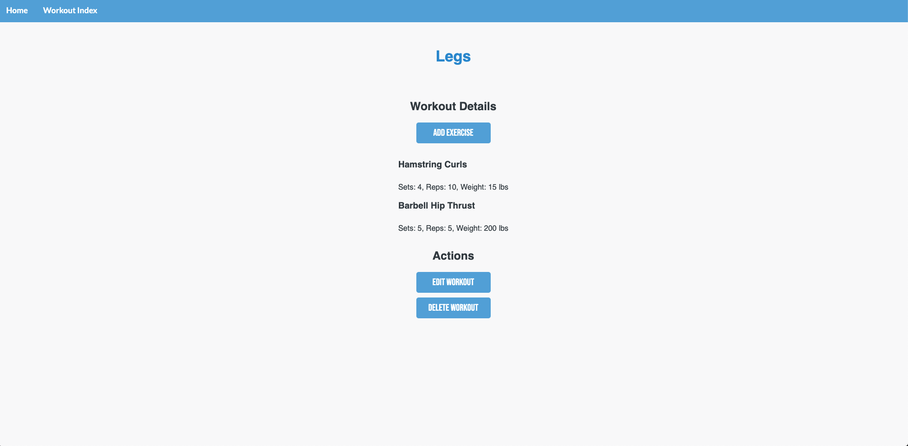
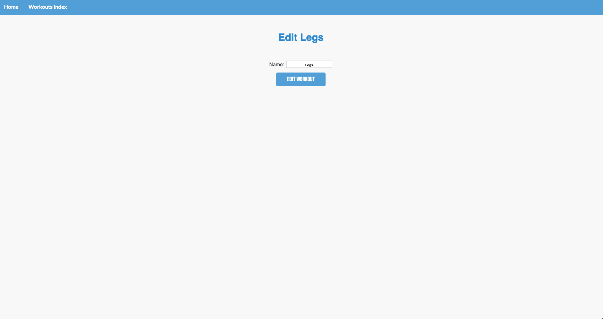
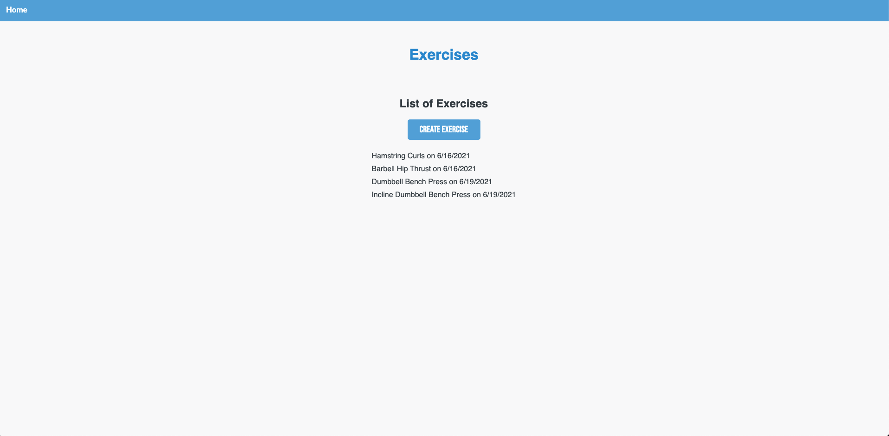
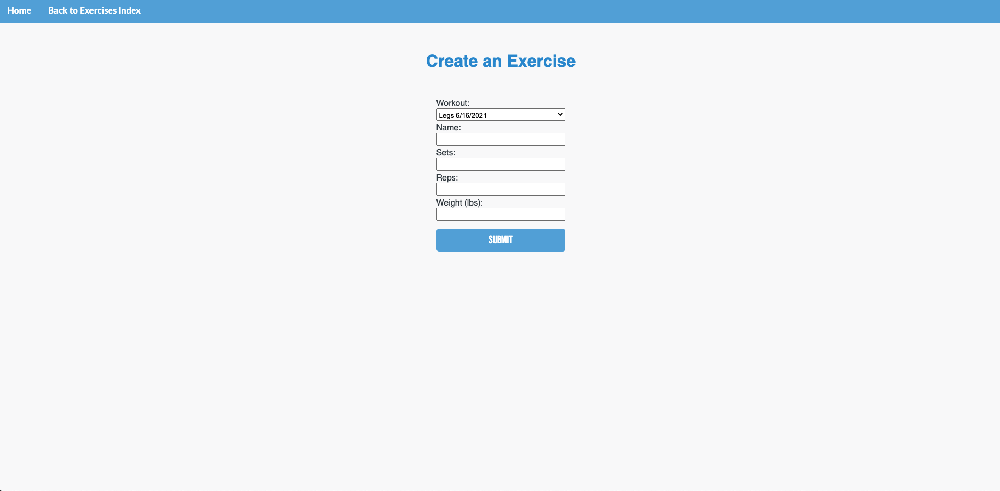
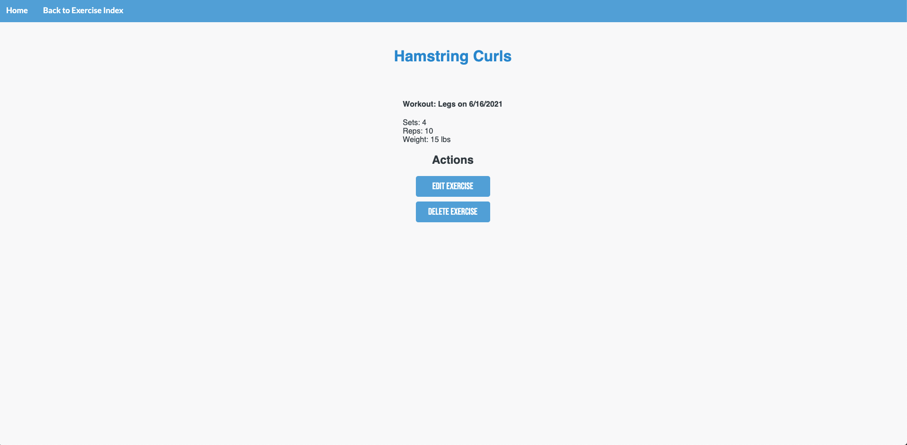
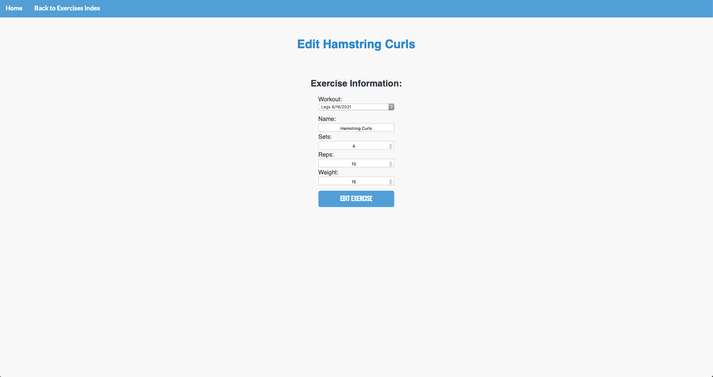

# Workout Tracker
A full-stack web app to allow users to create and track their workouts and exercises. 

The idea behind the app was to ditch paper, and allow users to be able to create a workout with associated exercises for a plan or to log their workout split for the day. 

## User Stories
- As a user, I want to create a workout and associated exercises.
- As a user, I want to be able to log in and out.
- As a user, I want edit/delete to be restricted to an authenticated user. 

## Technologies
- HTML5
- CSS3
- JavaScript
- EJS
- Nodejs
- Express
- Mongoose
- MongoDB
- morgan
- bcrypt
- Dotenv
- [Icons8](https://icons8.com)
- [Google Fonts](https://fonts.google.com)

## Screenshots

### ERD

### Wireframes

### Images of Working App

## Getting Started
[Click here](https://czt-workout-tracker.herokuapp.com) to see the deployed app

## Future Enhancements
- implement search bar
- edit/delete restriction to the user who created the workout and exercise
- Oauth to avoid remembering username and password
- graph to allow user to visualize progressive overload